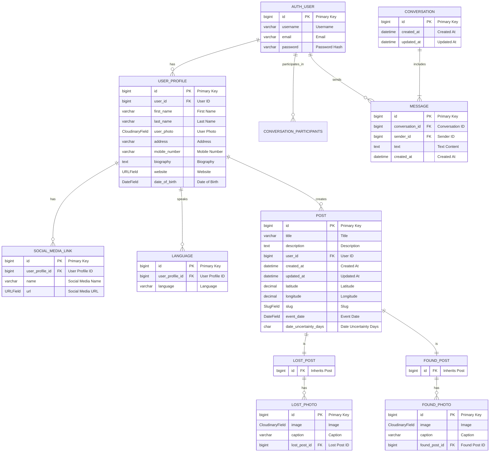

# My Precious

## Introduction

"My Precious" is an innovative online platform designed to reconnect individuals with their lost valuables. Understanding the distress and frustration of losing personal items, My mission was to create a community-driven space where users can post about lost or found items, facilitating the joyful reunion of people with their belongings. Whether it's a key fob or a cherished heirloom, "My Precious" stands as a beacon of hope and solidarity.

[Live Page](https://project-4-django-my-precious-180ebe0871af.herokuapp.com)

<!-- TOC -->
* [My Precious](#my-precious)
  * [Introduction](#introduction)
  * [User Experience and Design](#user-experience-and-design)
    * [Strategy](#strategy)
    * [Execution](#execution)
    * [User Stories](#user-stories)
  * [App Structure](#app-structure)
    * [Project was created based on Agile:](#project-was-created-based-on-agile)
      * [Milestones](#milestones)
      * [User Stories:](#user-stories-1)
  * [Website / App structure](#website--app-structure)
    * [Users:](#users)
  * [Tools and Technologies:](#tools-and-technologies)
    * [Services:](#services)
  * [Navigation Menu](#navigation-menu)
      * [Big Screen:](#big-screen)
      * [Medium Screen:](#medium-screen)
      * [Small screen Navigation:](#small-screen-navigation)
  * [Testing](#testing)
    * [Responsiveness](#responsiveness)
    * [Validation](#validation)
      * [HTML](#html)
      * [CSS](#css)
      * [Python](#python)
  * [Project Deployment Guide](#project-deployment-guide)
    * [Introduction](#introduction-1)
    * [How to Run This Project Within a Local IDE:](#how-to-run-this-project-within-a-local-ide)
    * [Preparing the Environment and `settings.py` File](#preparing-the-environment-and-settingspy-file)
      * [Configuration Guide](#configuration-guide)
    * [Deploying on Heroku](#deploying-on-heroku)
    * [Forking the Repository](#forking-the-repository)
  * [Manual Testing](#manual-testing)
    * [Function Testing](#function-testing)
    * [Automatic Testing](#automatic-testing)
  * [Mistakes and Bugs](#mistakes-and-bugs)
  * [Future Implementations](#future-implementations)
<!-- TOC -->
## User Experience and Design

### Strategy

**Site Aims**: "My Precious" caters to anyone who has lost or found an item, emphasizing the power of community assistance. It's about transforming despair into joy, one post at a time. By fostering connections, we not only return lost items but also have the potential to forge lasting friendships.

### Execution

**Project Milestones**:

1. **Project Setup**: Establish the foundational structure, including initial app creation, database setup, GitHub repository, and Heroku deployment.
2. **User Authentication**: Implement secure login mechanisms and personal profile management.
3. **CRUD for Posts**: Enable users to create, read, update, and delete posts about lost and found items.
4. **Messaging System**: Facilitate user communication through direct messages.
5. **User-Friendly Design**: Prioritize intuitive navigation and layout design for an optimal user experience.
6. **Final Deployment**: Ensure a bug-free launch with full access to all project features.

### User Stories

- Authentication: Users can log in, authenticate, and log out.
- Profile Management: Users can update their profiles and add personal images.
- Post Interaction: Users have full control over creating and managing their posts, including adding photos and locations.
- Community Engagement: Authenticated users can view, search, and interact with posts and profiles of other users.
- Direct Messaging: Users can communicate privately through the built-in messaging system.

## App Structure

"My Precious" is built around three core applications:

1. **Users**: Manages user authentication and profiles.
2. **Posts**: Handles the creation and management of lost and found posts.
3. **Conversations**: Facilitates user-to-user messaging.

### Project was created based on Agile:

#### Milestones

1. Project Setup (This is the most important part):
    * Create Fist app, setup database, create repository on GitHub and ofcourse deploy to Heroku, just to make sure all
      is working.
2. User Login and Authentication:
    * Allow user to login and be authenticated on website, what will open all content of project
    * User can update add more personal information to profile
3. Posts:
    * Includes all features of CRUD
4. Messages:
    * Users can communicate through messages
5. UX:
    * Layouts are designed to be easy to understand and navigate through website
6. Final Deployment:
    * Project is completed with no errors and users are able to access al project features

#### User Stories:
1. User can log in, be authenticated and Logout
   * User can log in
   * user is authenticated
   * User can log out
2. User can access personal profile and update it
   * User can add additional information to profile
   * User can add personal Photo/Image to Profile
3. User can create a post
   * User can create a post
   * User can update a post
   * User can add photos to post
   * User can add location to post
   * User can delete post
4. User can access other users posts
   * Only authenticated users can see posts details
5. User can search for specific post
   * User can Search Posts
   * User can filtrate posts
6. Users can communicate - messaging
   * User can send a message
   * User can receive a message
7. Users can access/see other user profile, and see posts made by that specific user
   * Only authenticated users can see profile details

## Website / App structure


All Project is made out of only 3 apps:
1. Users
2. Posts
3. Conversations



### Users:
1. Users App is made of 2 tables:
   * Auth User - This is Default Django model, I could, but I did not want to implement more fields to model, I left it as it is, simple and reliable Django built in Model for Authentication
   * Profile - This table is linked to Auth-User as 1-to-1 relationship:
     * This allows me to add as many fields as I want to user Profile
     * Do not have to touch Django build in User model for Authentication
     * If needed (for this project I did not see need), one user can have multiple Profiles. Just change relationship as 1-to-many
     * And most important 0- scalability. In such existing structure, App can be very fast, easy to create as many fields in profile, and light on database
   • Photo - Profile picture, linked to Profile with 1-to-1 relationship
2. Posts App consists of several tables:
   * Posts - This is Polymorphic Model. Yes, I had to use it, as initially (start of project) I wanted to implement DRY coding and used standard model Post as abstract, and then create 2 models based on it:
     * Lost Post
     * Found Post
     * Photos - Lost and Found posts have sub tables of Photos 
     
Smart Explanation why I had to switch from Abstract model to Polymorphic:

    All is because of search Field and Pagination. Search in 2 tables and paginate is a nightmare...
In standard model I can search Lost Posts, I can search Found posts, I can search both. But if I search 2 tables, and then I want to paginate it - it becomes complicated, this is where polymorphic model comes in.

3. Conversations consists of 2 tables:
    * Conversations - This is where one conversation can have as many participants as it is needed
    * Messages - this is just simple message linked to conversation and sender


Each app was built with intention of future re-usability, so they are pretty much independent:
* They have their own templates in app/templates folder 
* They have their own urls in app/urls.py, these urls are imported to project urls.

## Tools and Technologies:
###Tools:
* Pycharm - as Coding IDE
* Git - Source control 
### Services:
* GitHub - Source code hosting and source control
* Heroku - Django Deployment
* Cloudinary  Images hosting
* Elephant SQL - Database hosting
* Google Maps API - to show post location on maps
###Languages:
* HTML - Used for static HTML files and templates
* Bootstrap5 and custom styles.css - layouts styling
* Javascript - page interactivity and dynamic content management
* Python - main language of project
* Django - Python framework
* Some Jquery/Ajax - some pages required some background interactions to database, so I adapted code snippets from internet for my project
* SQL - database queries 


## Navigation Menu
Navigation is divided into 3 parts:
#### Big Screen:
* Top Navigation has fields:
  * 
  * Branding - My precious, navigates to home page
  * Search field
  * Home Button
  * Users - All Users List
  * Create a post
  * Account:
    * 
    * User Messages
    * Create a post
    * User Profile
    * Update Profile
    * Log Out
* Bottom Navigation:
  * 
  * Branding with Year
  * Link to Source Code
  * Link to Linked In
#### Medium Screen:
* Top Navigation:
  * 
  * Branding
  * Search button
  * Drop Down menu:
    * 
    * Home
    * Users - List of users
    * Create a post
    * Account - drop down
      * :
      * Messages
      * Create A post
      * User Profile
      * Update Profile
      * Log Out
* Bottom Navigation - Same as on Big Screen
#### Small screen Navigation:
* Top Navigation:

  * Branding
  * Search Field
* Bottom Navigation:

  * Home Button
  * Messages
  * Account Icon:
  * 
    * Create A post
    * User List
    * Profile
    * Update Profile
    * Log Out
  * Question Mark drop down:
  
  * Link to Source Code
  * Link to Linked In

## Testing
### Responsiveness
Website was checked for responsiveness all time during development, checking layouts for different types and sizes of screens and devices.

### Validation
#### HTML
Website was inspected through [W3C Validator](https://validator.w3.org).
Every page has gone through procedures:
1. Open page on running Django project
2. Right click on page to inspect code
3. Copy all HTML code
4. Paste to Validator as 'direct input'
#### CSS
To validate Css I have used [W3C CSS Jigsaw Validator]
Custom styles.css file was uploaded and validated
(https://jigsaw.w3.org/css-validator/)


#### Python
All Python code was inspected and no errors found on [CI Python Linter](https://pep8ci.herokuapp.com)


## Project Deployment Guide

### Introduction

This project was developed using [PyCharm](https://www.jetbrains.com/pycharm/). The code was committed and pushed to [GitHub](https://github.com/) using the terminal.

### How to Run This Project Within a Local IDE:

1. Log into [GitHub](https://github.com/login) or [create an account](https://github.com/join).
2. Locate the [GitHub Repository](https://github.com/Tomosius/My_Precious).
3. Under the repository name, click "Clone or download".
4. In the Clone with HTTPs section, copy the clone URL for the repository.
5. In your local IDE open the terminal.
6. Change the current working directory to the location where you want the cloned directory to be made.
7. Type 'git clone', and then paste the URL you copied:
   ```bash
   git clone https://github.com/Tomosius/My_Precious
   ```
8. Press Enter. Your local clone will be created.

For further reading and troubleshooting on cloning a repository from GitHub, see [GitHub Docs on Cloning a Repository](https://docs.github.com/en/github/creating-cloning-and-archiving-repositories/cloning-a-repository).

### Preparing the Environment and `settings.py` File

Before running the application, ensure that your environment and Django settings are correctly configured:

#### Configuration Guide

1. `DATABASE_URL` (Recommended: PostgreSQL)
   - **Heroku Configuration:**
     - In the Settings tab of your Heroku dashboard, click on 'Reveal Config Vars'.
     - Copy the URL next to `DATABASE_URL`.
   - **Local Setup:**
     - In your workspace, create an `env.py` file in the main directory.
     - Add the `DATABASE_URL` value to this file.

2. `SECRET_KEY`
   - Add the `SECRET_KEY` value to the Config Vars in Heroku.
   - Ensure this key is also stored securely in your `env.py` file for local development.

3. `CLOUDINARY` for Image Storage
   - **Configuration Variables:**
     - `CLOUDINARY_CLOUD_NAME`
     - `CLOUDINARY_API_KEY`
     - `CLOUDINARY_API_SECRET`
   - **Updating Config Vars:**
     - Update the Config Vars on Heroku with the Cloudinary variables.
     - Ensure these are also correctly referenced in your `env.py`.

4. `GOOGLE_MAPS_API_KEY`
   - Store and reference your Google Maps API key as needed for location-based features in both Heroku and your `env.py`.

### Deploying on Heroku

1. Create the Heroku App:
   - Select "Create new app" in Heroku.
   - Choose a name for your app and select the location.

2. Store Static and Media files in Cloudinary and Deploy to Heroku:
   - Create three directories in the main directory; media, storage, and templates.
   - Create a file named "Procfile" in the main directory and add the following:
     ```
     web: gunicorn project-name.wsgi
     ```
   - Go to the Deploy tab on Heroku, connect to the GitHub, then to the required repository.
   - Click on "Deploy Branch" and wait for the build to load. When the build is complete, the app can be opened through Heroku.

### Forking the Repository

By forking the GitHub Repository we make a copy of the original repository on our GitHub account to view and/or make changes without affecting the original repository by using the following steps:

1. Log into [GitHub](https://github.com/login) or [create an account](https://github.com/join).
2. Locate the [GitHub Repository](https://github.com/Tomosius/My_Precious).
3. At the top of the repository, on the right side of the page, select "Fork".
4. You should now have a copy of the original repository in your GitHub account.


## Manual Testing
### Function Testing
| Function                      | Action                                                                                                                                                                                                   | What is Expected                                                                                                                                                                                                                                                                                                                                     | Result |
|-------------------------------|----------------------------------------------------------------------------------------------------------------------------------------------------------------------------------------------------------|------------------------------------------------------------------------------------------------------------------------------------------------------------------------------------------------------------------------------------------------------------------------------------------------------------------------------------------------------|--------|
| Create Account                | User creates an account using login and password (password has to be repeated) Email - optional                                                                                                          | User is being redirected to Home page to login with new credentials                                                                                                                                                                                                                                                                                  | Passed |
| Log In                        | User uses username and password and Logs In                                                                                                                                                              | User is being redirected to Home page, all menu of navigation is active and links working. User is Authenticated                                                                                                                                                                                                                                     | Passed |                   
| Log Out                       | User clicks link to log out                                                                                                                                                                              | User is logged out from his account, redirected to Home Page                                                                                                                                                                                                                                                                                         | Passed |
| Navigation links are active   | After User  Is authenticated, links become active                                                                                                                                                        | User can navigate on app / website                                                                                                                                                                                                                                                                                                                   | Passed |
| Posts                         | User can see All Posts, Lost, Found and Map in details                                                                                                                                                   | User can see all posts and their details                                                                                                                                                                                                                                                                                                             | Passed |
| All Posts                     | User can see All posts                                                                                                                                                                                   | All posts on project are visible on selected Tab                                                                                                                                                                                                                                                                                                     | Passed |
| Lost Posts                    | ONLY Lost posts are visible                                                                                                                                                                              | Only Lost posts are displayed                                                                                                                                                                                                                                                                                                                        | Passed |
| Found Posts                   | ONLY Found Posts are displayed                                                                                                                                                                           | Only Found posts are displayed                                                                                                                                                                                                                                                                                                                       | Passed |
| Map                           | All Posts are displayed on Map                                                                                                                                                                           | User Can see Posts on Map                                                                                                                                                                                                                                                                                                                            | Passed |
| Map Markers                   | Posts on map are in 2 colors                                                                                                                                                                             | Posts are divided in 2 Colors: Green - Found, Red - Lost                                                                                                                                                                                                                                                                                             | Passed |
| Map Markers pop ups           | Marker on Map clicked                                                                                                                                                                                    | Pop Up appears with Post title                                                                                                                                                                                                                                                                                                                       | Passed |
| Marker Redirection            | User clicks on title on MAp Marker Pop Up                                                                                                                                                                | User is redirected to Post details page                                                                                                                                                                                                                                                                                                              | Passed |
| Posts pagination              | Posts are paginated                                                                                                                                                                                      | Posts are paginated, user can see number of pages, and page number user is in at given point                                                                                                                                                                                                                                                         | Passed |
| User can set pagination       | User can select posts quantity per page                                                                                                                                                                  | Posts are re-paginated per user settings                                                                                                                                                                                                                                                                                                             | Passed |   
| Search all posts              | User is in All post tab or anywhere else and searches for word                                                                                                                                           | App searches all posts in title and description and returns results                                                                                                                                                                                                                                                                                  | Passed |
| Search Lost Posts             | Useer is in Lost Posts section and searches                                                                                                                                                              | App searches ONLY LOST posts (title and description) and displays results                                                                                                                                                                                                                                                                            | Passed |
| Search Found Posts            | User is in Found Posts section and searches                                                                                                                                                              | App searches only FOUND posts (title and description) and displays results                                                                                                                                                                                                                                                                           | Passed |
| Conversations                 | User Conversations section                                                                                                                                                                               | User is displayed with all conversations with other users                                                                                                                                                                                                                                                                                            | Passed |
| Conversations/Another User    | In Conversation section user clicks on button with other user name                                                                                                                                       | User is presented with messages history, at the bottom - form with send message feature. At beginning Each button is presented with Participants name and last 3 messages. When Drop down appears - last 3 messages are removed from button                                                                                                          | Passed |
| Conversations Send Message    | In conversations User fills form, sends message                                                                                                                                                          | Message is sent, user is redirected to specific conversion page                                                                                                                                                                                                                                                                                      | Passed |
| Create Post                   | User clicks Create Post                                                                                                                                                                                  | User is redirected to page for post creation                                                                                                                                                                                                                                                                                                         | Passed |
| Post Type Selector            | User Selects Post type                                                                                                                                                                                   | After User Selects Post type, Submit Button becomes Active                                                                                                                                                                                                                                                                                           | Passed |
| Post Photos                   | User adds Photos to Post                                                                                                                                                                                 | User can select multiple photos for Post                                                                                                                                                                                                                                                                                                             | Passed |
| Post Location                 | User can select On map Location of Event (Lost or Found)                                                                                                                                                 | When User clicks on Map, Coordinates of event is passed through Javascript to app                                                                                                                                                                                                                                                                    | Passed |
| Post Update                   | User Selects to update Post                                                                                                                                                                              | Only Owner of Post can Modify It. UseCan Update Post by entering Original Post, at the bottom of page clicking Update Post button. User is redirected to Update Post section                                                                                                                                                                         | Passed |
| Post Update add Photos        | User selects more Photos to upload                                                                                                                                                                       | User can select More Photos to upload. Submitting. Photos are added to post and redirecting to original Post Details Page                                                                                                                                                                                                                            | Passed |
| Post Update delete Photos     | User deletes Photos                                                                                                                                                                                      | After User clicks X in red circle at the top right corner of photo, photo is deleted and page is dynamically refreshed in background. Takes some time as Heroku, Cloudinary and Elephant Sql - are Free Tier, so not so fast app                                                                                                                     | Passed |
| Post Update - change Location | User clicks on different location on map                                                                                                                                                                 | Coordinates are changes, and when submitted updated on database. User is redirected to Original Posst Page                                                                                                                                                                                                                                           | Passed |
| Post Delete                   | User deletes Post                                                                                                                                                                                        | Only Owner of post can delete i. When user is in original Post details page, near update post button, there is DELETE BUTTON. Post Is deleted, user is redirected to Home Page                                                                                                                                                                       | Passed |
| Post title change             | User changes Title                                                                                                                                                                                       | After user changes title, new SLUG is generated, user is redirected to Post details page                                                                                                                                                                                                                                                             | Passed |
| Post Slug redirection         | User creates Post, Slug (url) will be generated. User shares link to friend. Later user changes post title and new slug (url) is generated based on title. Now friend tries to access post by an old URL | App Tries to identify post by slug, if post is not found, then app will try following:<br/>1.Identify Post Type from Slug. <br/>2. Retrieve Post Id from Slug.<br/>3. By given post type and ID, app retrieves original Slug (url).<br/>4. App redirects to original post with new slug. Friend can see post with new slug(url) and save link to it. | Passed |
| User Profile                  | User clicks on Profile                                                                                                                                                                                   | User can see all personal details (if provided) and Persona Posts                                                                                                                                                                                                                                                                                    | Passed |
| User Profile Update           | User changes Profile                                                                                                                                                                                     | User can change any profile details Field and save it                                                                                                                                                                                                                                                                                                | Passed |
| User Credentials change       | User changes login/password on Profile Update                                                                                                                                                            | User can change credentials, after saving user is redirected to Profile page                                                                                                                                                                                                                                                                         | Passed |

### Automatic Testing
No automatic testing was done at current stage

## Mistakes and Bugs


There is following mistakes in project, but they are needed, as Profile Page is needing Buttons with href, as it is dynamic page.
On big screen it is 2 separate columns:
1. Left side - User Profile
2. User Posts - if sending message, content will be replaced to messages and afterward posts will be displayed again


On smaller screens User is given 2 tabs:
1. User Profile
2. Posts

Buttons are needed with href, as if visiting another user profile, current (authorised) user can send a message, which will be added to existing conversation, if such does not exist, new one will be created.
When clicking on message button, Javascript will replace Posts in html with messages from conversation. when it is closed, all messages will be hidden and post will be displayed.
At the same time, there is second javascript, that copies HTML code from one part to another, so there is no need to create page 2 times (write code 2 times. DRY)

## Future Implementations
1. Get decent hosting service for project, database and images hosting - increase app speed
2. PostgresSQL - install PostGIS, Django - GeoDjango API. this would enable search by location and better UX
3. Improve Site Layout (Sorry but my creativity with layouts is minimal... I am more maths and physics person)
4. Add Password recovery. Even I created gmail specifically for project, somehow google is not very keen to allow such easy access for project to emails...


    
